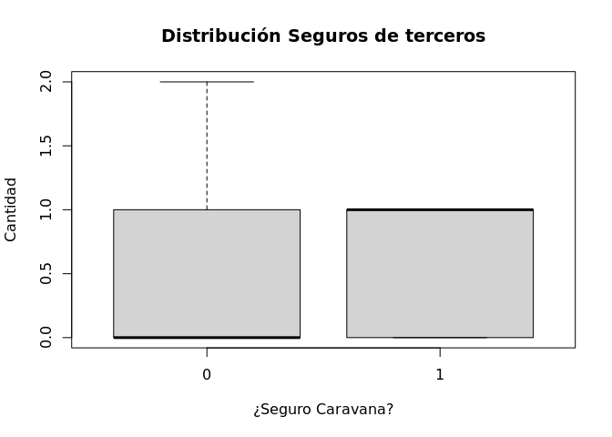

Proyecto Final
================
Eduardo Gamboa Ureña y Malincy Montoya Rodríguez
15 diciembre de 2016

## Análisis del Problema

Para una compañía aseguradora, es importante tener muchos clientes,
seguros que, aún cuando es poco probable que sean utilizados por sus
clientes, generen ganancias para ellos y para, en general, los
accionistas de la empresa. A fin de lograr esto, es necesario atacar,
con la publicidad correcta, al mercado correcto, a fin de que estos
futuros clientes puedean obtener, de manera rápida, los productos
ofrecidos. A fin de poder conocer el mercado de los seguro para
caravanas, un vehículo que está equipado para vivir en él, se realizaron
muestras de diversas variables del contexto de futuros clientes, a fin
de poder conocer si, dado un cierto grupo de características, la persona
compraría un seguro o no.

## Entendimiento de los Datos

A continuación un diccionario de datos, los cuales serán los analizados
en este trabajo:

1.  MOSTYPE Tipo de cliente. Categórica. Los posibles valores son:
    1.  Ingreso alto, con niños caros
    2.  Provinciano muy importante
    3.  Ancianos de alto estado social
    4.  Ancianos aluentes con apartamentos
    5.  Ancianos mezclados
    6.  Cuidadores, ya sea de adultos o de niños
    7.  Doble ingreso, sin niños
    8.  Familias clase media
    9.  Familias modernas completas
    10. Familias estables
    11. FAmilias iniciando
    12. Familias jóvenes afluentes
    13. Familia joven, todos estadounidenses
    14. Cosmopolita joven
    15. Cosmopolita anciano
    16. Estudiantes en apartamentos
    17. Recién graduados en la ciudad
    18. Joven soltero
    19. Joven suburbano
    20. Étnicamente diverso
    21. Joven urbano sin beneficios materiales
    22. Varias personas que viven en apartamentos
    23. Jóvenes y creciendo
    24. Jóvenes, baja educación
    25. Ancianos jóvenes en la ciudad
    26. Ancianos dueños de casa
    27. Ancianos en apartamentos
    28. Ancianos residenciales
    29. Ancianos sin patio delantero
    30. Ancianos solteros religiosos
    31. Católicos con bajo ingreso
    32. Ancianos mezclados
    33. Familias largas de baja clase
    34. Familias largas, con hijos empleados
    35. Familias de villas
    36. Familia con adolescentes
    37. Habitantes mezclados de pueblos pequeños
    38. Familia tradicional
    39. Familias religiosas largas 40 Largas Familia de granjas
    40. Rurales mezcladas
2.  MAANTHUI Número de casas, de 1 a 10
3.  MGEMOMV Tamaño promedio de casa, de 1 a 6
4.  MGEMLEEF Edad promedio.
    1.  20-30 años
    2.  30-40 años
    3.  40-50 años
    4.  50-60 años
    5.  60-70 años
    6.  70-80 años
5.  MOSHOOFD Categórica. Tipo de cliente principal.
    1.  Hedonista exitoso
    2.  Granjero conducido
    3.  Familia Promedio
    4.  Deudor de prestamos para carreras
    5.  Viviendo bien
    6.  Ancianos viajeros
    7.  Retirados y religiosos
    8.  Familia con personas adultas
    9.  Familias conservativas
    10. Granjeros
6.  MGODRK Católicos romanos
7.  MGODPR Protestantes
8.  MGODOV Otra religion
9.  MGODGE Sin Religion
10. MRELGE Casado
11. MRELSA Viviendo Juntos
12. MRELOV Otra relación
13. MFALLEEN Solteros
14. MFGEKIND Ocupantes de casa sin niños
15. MFWEKIND Ocupantes de casa sin niños
16. MOPLHOOG Educación de alto nivel
17. MOPLMIDD Educación media
18. MOPLLAAG Educación baja
19. MBERHOOG Alto estatus
20. MBERZELF Emprendedor
21. MBERBOER Granjero
22. MBERMIDD Administrador medio
23. MBERARBG Trabajador con habilidades
24. MBERARBO Trabajador sin habilidades
25. MSKA Clase social A
26. MSKB1 Clase social B1
27. MSKB2 Clase social B2
28. MSKC Clase social C
29. MSKD Clase social D
30. MHHUUR Casa rentada
31. MHKOOP Dueños de casa
32. MAUT1 1 auto
33. MAUT2 2 autos
34. MAUT0 Sin autos
35. MZFONDS Servicio nacional de salud
36. MZPART Seguro de salud privado
37. MINKM30 Ingreso menor de 30.000
38. MINK3045 Ingreso entre 30-45.000
39. MINK4575 Ingreso entre 45-75.000
40. MINK7512 Ingreso entre 75-122.000
41. MINK123M Ingreso mayor que 123.000
42. MINKGEM Ingreso promedio
43. MKOOPKLA Clase de poder de compra
44. PWAPART Contribución de seguros de terceros
45. PWABEDR Contribución de seguros de terceros
46. PWALAND Contribución de seguros de terceros en agricultura
47. PPERSAUT Contribución en contratos de seguros de automóviles
48. PBESAUT Contribución en contratos de seguros en camionetas de
    entrega
49. PMOTSCO Contribución en contratos de seguros motocicletas
50. PVRAAUT Contribución en contratos de seguros de camiones
51. PAANHANG Contribución en contratos de seguros de trailers
52. PTRACTOR Contribución en contratos de seguros de tractores
53. PWERKT Contribución en contratos de seguros de maquinas de
    agrcultura
54. PBROM Contribución en contratos de seguros motocicletas pequeñas
55. PLEVEN Contribución de seguros de vida
56. PPERSONG Contribución en contratos de seguros de accidentes privados
57. PGEZONG Contribución en contratos de seguros de accidentes de famiia
58. PWAOREG Contrato de seguros de contribución de invalidez
59. PBRAND Contrato de seguros de contribución de seguros contra
    incendios
60. PZEILPL Contrato de seguros de contribución en seguros de tablas de
    surf
61. PPLEZIER Contrato de seguros de contribución en seguros de botes
62. PFIETS Contrato de seguros de contribución en seguros de bicicletas
63. PINBOED Contrato de seguros de contribución de seguros de
    propiedades
64. PBYSTAND Contrato de seguros de contribución de seguro social
65. AWAPART Número de seguros de terceros
66. AWABEDR Número de firmas de seguros de terceras personas
67. AWALAND Número de seguros de terceras personas
68. APERSAUT Número de contratos de seguros de automóviles
69. ABESAUT Número de contratos de seguros de camionetas de entrega
70. AMOTSCO Número de contratos de seguros de motocicletas o scooter
71. AVRAAUT Número de contratos de seguros de camiones
72. AAANHANG Número de contratos de seguros de trailer
73. ATRACTOR Número de contratos de seguros tractor
74. AWERKT Número de contratos de seguros de maquinaria de agricultura
75. ABROM Número de contratos de seguros en moticicletas pequeñas
76. ALEVEN Número de seguros de vida
77. APERSONG Número de contratos de seguros de accidente privado
78. AGEZONG Número de contratos de seguros de accidentes familiares
79. AWAOREG Número de contratos de seguros de invalidez familiares
80. ABRAND Número de contratos de seguros de incendios
81. AZEILPL Número de contratos de seguros de tablas de surf
82. APLEZIER Número de contratos de seguros de botes
83. AFIETS Número de contratos de seguros de bicicletas
84. AINBOED Número de contratos de seguros de propiedades
85. ABYSTAND Número de contratos de seguros de seguro social
86. CARAVAN Número de contratos de casas móviles. 0 o 1.

Además, como notas aclaratorias:

1.  Las variables que inician con M son variables de área, no
    específicas del cliente. Se basan en el código ZIP donde el cliente
    está ubicado, y reflejan la distribución de la variable en cuestión
2.  Las siguientes columnas comparten su dominio, los valores que solo
    pertenecen a una sola columna están especificados en la lista
    anterior:
    1.  Columnas de la 7 a la 43, todas estas se comportan como
        porcentajes. Los valores se especifican a continuación:
        0.  0%
        1.  1 - 10%
        2.  11 - 23%
        3.  24 - 36%
        4.  37 - 49%
        5.  50 - 62%
        6.  63 - 75%
        7.  76 - 88%
        8.  89 - 99%
        9.  100%
    2.  Las columnas de la 44 a la 64, todas son valores monetarios. Sus
        posibles valores son:
        0.  0
        1.  1 a 49
        2.  50 a 99
        3.  100 a 199
        4.  200 a 499
        5.  500 a 999
        6.  1000 a 4999
        7.  5000 a 9999
        8.  10.000 a 19.999
        9.  20.000 o mayor
    3.  Las columnas de la 45 a la 85, son numéricas, con rango de 1 a
        12

## Exploración de los Datos

Se procede a cargar los datos, a fin de poder procesarlos en la
herramienta. Se brinda también un resumen de la estructura de los mismos

``` r
columnas = c('MOSTYPE', 'MAANTHUI', 'MGEMOMV', 'MGEMLEEF', 'MOSHOOFD', 'MGODRK', 'MGODPR', 'MGODOV', 'MGODGE', 'MRELGE', 'MRELSA', 'MRELOV', 'MFALLEEN', 'MFGEKIND', 'MFWEKIND', 'MOPLHOOG', 'MOPLMIDD', 'MOPLLAAG', 'MBERHOOG', 'MBERZELF', 'MBERBOER', 'MBERMIDD', 'MBERARBG', 'MBERARBO', 'MSKA', 'MSKB1', 'MSKB2', 'MSKC', 'MSKD', 'MHHUUR', 'MHKOOP', 'MAUT1', 'MAUT2', 'MAUT0', 'MZFONDS', 'MZPART', 'MINKM30', 'MINK3045', 'MINK4575', 'MINK7512', 'MINK123M', 'MINKGEM', 'MKOOPKLA', 'PWAPART', 'PWABEDR', 'PWALAND', 'PPERSAUT', 'PBESAUT', 'PMOTSCO', 'PVRAAUT', 'PAANHANG', 'PTRACTOR', 'PWERKT', 'PBROM', 'PLEVEN', 'PPERSONG', 'PGEZONG', 'PWAOREG', 'PBRAND', 'PZEILPL', 'PPLEZIER', 'PFIETS', 'PINBOED', 'PBYSTAND', 'AWAPART', 'AWABEDR', 'AWALAND', 'APERSAUT', 'ABESAUT', 'AMOTSCO', 'AVRAAUT', 'AAANHANG', 'ATRACTOR', 'AWERKT', 'ABROM', 'ALEVEN', 'APERSONG', 'AGEZONG', 'AWAOREG', 'ABRAND', 'AZEILPL', 'APLEZIER', 'AFIETS', 'AINBOED', 'ABYSTAND', 'CARAVAN')
datos = read.table('ticdata2000.txt', header = F, col.names = columnas)
datos$MOSTYPE <- factor(datos$MOSTYPE)
datos$MGEMLEEF <- factor(datos$MGEMLEEF)
datos$MOSHOOFD <- factor(datos$MOSHOOFD)
datos$MGODRK <- factor(datos$MGODRK)
datos$MGODPR <- factor(datos$MGODPR)
datos$MGODOV <- factor(datos$MGODOV)
datos$MGODGE <- factor(datos$MGODGE)
datos$MRELGE <- factor(datos$MRELGE)
datos$MRELSA <- factor(datos$MRELSA)
datos$MRELOV <- factor(datos$MRELOV)
datos$MFALLEEN <- factor(datos$MFALLEEN)
datos$MFGEKIND <- factor(datos$MFGEKIND)
datos$MFWEKIND <- factor(datos$MFWEKIND)
datos$MOPLHOOG <- factor(datos$MOPLHOOG)
datos$MOPLMIDD <- factor(datos$MOPLMIDD)
datos$MOPLLAAG <- factor(datos$MOPLLAAG)
datos$MBERHOOG <- factor(datos$MBERHOOG)
datos$MBERZELF <- factor(datos$MBERZELF)
datos$MBERBOER <- factor(datos$MBERBOER)
datos$MBERMIDD <- factor(datos$MBERMIDD)
datos$MBERARBG <- factor(datos$MBERARBG)
datos$MBERARBO <- factor(datos$MBERARBO)
datos$MSKA <- factor(datos$MSKA)
datos$MSKB1 <- factor(datos$MSKB1)
datos$MSKB2 <- factor(datos$MSKB2)
datos$MSKC <- factor(datos$MSKC)
datos$MSKD <- factor(datos$MSKD)
datos$MHHUUR <- factor(datos$MHHUUR)
datos$MHKOOP <- factor(datos$MHKOOP)
datos$MAUT1 <- factor(datos$MAUT1)
datos$MAUT2 <- factor(datos$MAUT2)
datos$MAUT0 <- factor(datos$MAUT0)
datos$MZFONDS <- factor(datos$MZFONDS)
datos$MZPART <- factor(datos$MZPART)
datos$MINKM30 <- factor(datos$MINKM30)
datos$MINK3045 <- factor(datos$MINK3045)
datos$MINK4575 <- factor(datos$MINK4575)
datos$MINK7512 <- factor(datos$MINK7512)
datos$MINK123M <- factor(datos$MINK123M)
datos$MINKGEM <- factor(datos$MINKGEM)
datos$MKOOPKLA <- factor(datos$MKOOPKLA)
datos$PWAPART <- factor(datos$PWAPART)
datos$PWABEDR <- factor(datos$PWABEDR)
datos$PWALAND <- factor(datos$PWALAND)
datos$PPERSAUT <- factor(datos$PPERSAUT)
datos$PBESAUT <- factor(datos$PBESAUT)
datos$PMOTSCO <- factor(datos$PMOTSCO)
datos$PVRAAUT <- factor(datos$PVRAAUT)
datos$PAANHANG <- factor(datos$PAANHANG)
datos$PTRACTOR <- factor(datos$PTRACTOR)
datos$PWERKT <- factor(datos$PWERKT)
datos$PBROM <- factor(datos$PBROM)
datos$PLEVEN <- factor(datos$PLEVEN)
datos$PPERSONG <- factor(datos$PPERSONG)
datos$PGEZONG <- factor(datos$PGEZONG)
datos$PWAOREG <- factor(datos$PWAOREG)
datos$PBRAND <- factor(datos$PBRAND)
datos$PZEILPL <- factor(datos$PZEILPL)
datos$PPLEZIER <- factor(datos$PPLEZIER)
datos$PFIETS <- factor(datos$PFIETS)
datos$PINBOED <- factor(datos$PINBOED)
datos$PBYSTAND <- factor(datos$PBYSTAND)
datos$CARAVAN <- factor(datos$CARAVAN)
library(caTools)
set.seed(123456)
splitted <- sample.split(datos, SplitRatio = 0.7)
datos.entrenamiento <- datos[splitted,]
datos.prueba <- datos[!splitted,]
#Retirar factores 5 y 6 de PINBOED de datos de prueba porque no está en datos de entrenamiento
datos.prueba <- datos.prueba[datos.prueba$PINBOED != 6 & datos.prueba$PINBOED != 5,]
```

Una parte importante de estos datos es describir la distribución de la
variable que se desea predecir, la cual es CARAVAN, a fin de conocer
cuantos clientes poseen el seguro de caravanas, o no.

``` r
barplot(table(datos.prueba$CARAVAN), 
        main="Distribución de compra de seguros",
        xlab = "Compró un seguro", 
        ylab="Cantidad")
```

<!-- -->

Es posible ver que, para los datos de prueba, pocos clientes compraron
el seguro de caravanas. Esto hace posible diferenciar que define un
comprador de seguros. Es posible verificar la relación entre los tipos
de clientes, a fin de saber que tipo de cliente tiende a comprar el
seguro de caravanas

``` r
compraronSeguros = datos.entrenamiento[as.integer(datos.entrenamiento$CARAVAN) == 2,]
barplot(table(compraronSeguros$MOSTYPE),
        main = "Distribución de tipos de clientes que \ncompraron seguro",
        xlab = "Tipo de cliente",
        ylab = "cantidad de clientes")
```

<!-- -->

Es posible observar que, de todos los clientes que compraron un seguro,
la gran mayoría son familias de clase media, seguido por familias de
clase baja, pero que son grandes (tipos 8 y 33 en el conjunto de datos)

A fin de poder verificar si existen relaciones entre clientes y
adquisición del producto, es importante conocer la distribución de los
tipos de clientes del conjunto de datos:

``` r
barplot(table(datos.entrenamiento$MOSTYPE),
        main = "Distribución de tipos de clientes  \nen el conjunto de datos",
        xlab = 'Tipo de cliente',
        ylab = 'cantidad de clientes')
```

<!-- -->

Se observa que la mayoría de clientes son familias largas de clase baja.
Sin embargo, contrastado con el gráfico anterior, son pocos tipos de
esta clientela que, en proporción, adquieren un seguro. Esto quiere
decir que a las personas que tienen pocos recursos, no les es posible
adquirir el seguro que se solicita. A fin de completar el análisis, se
procede a comparar las personas que, esta vez, no compraron seguro, a
fin de conocer la proporción entre los tipos de cliente

``` r
noCompraronSeguros = datos.entrenamiento[as.integer(datos.entrenamiento$CARAVAN) == 1,]
barplot(table(noCompraronSeguros$MOSTYPE),
        main = "Distribución de tipos de clientes \nque no compraron seguro",
        xlab = 'Tipo de cliente',
        ylab = 'cantidad de clientes')
```

<!-- -->

Aquí es claro ver que la gran mayoría de los clientes que no compraron
seguro fueron los de baja clase, lo que puede indicar que la clase es un
factor determinante en caso de ser necesaria una predicción. A
continuación se analiza la variable de respuesta por edad promedio para
ver si existen relaciones entre ambas variables.

``` r
library("lattice")
histogram(~MGEMLEEF|CARAVAN,data=datos.entrenamiento,xlab="Edad Promedio", main="Edad Promedio por Seguro Caravana")
```

<!-- -->

Tanto los que adquirieron como los que no adquirieron seguro de caravana
presentan el mismo patrón en los rangos de edades promedio.
Probablemente, esto implique que no sea una variable determinante para
la variable de respuesta.

Otro factor que podría ser útil es el ingreso de las familias.

``` r
#summary(datos.entrenamiento$MINKGEM)
histogram(~MINKGEM|CARAVAN,data=datos.entrenamiento,xlab="Ingreso promedio", main="Ingreso promedio por Seguro Caravana")
```

<!-- -->

Se observa en el gráfico que la mayoría de familias sin seguro de
caravana se concentran en los grupos 3 y 4 que corresponden a 24 - 36% y
37 - 49% de ingreso promedio, respectivamente. Aquellos que si
adquirieron seguro tienen mayoría en el grupo de 37 - 49%. Esto no es
una separación clara pero podría usarse para intentar resolver el
problema.

Ahora se explora otro factor que podría ser útil, la cantidad de seguros
de la familia. Se exploran algunos de los tipos de seguro registrados.

``` r
#Terceros
#summary(datos.entrenamiento$AWAPART)
boxplot(as.integer(datos.entrenamiento$AWAPART) ~ datos.entrenamiento$CARAVAN, main = "Distribución Seguros de terceros", ylab = "Cantidad", xlab = "¿Seguro Caravana?")
```

<!-- -->

``` r
#Automóviles
#summary(datos.entrenamiento$APERSAUT)
boxplot(as.integer(datos.entrenamiento$APERSAUT) ~ datos.entrenamiento$CARAVAN, main = "Distribución Seguros de auto", ylab = "Cantidad", xlab = "¿Seguro Caravana?")
```

<!-- -->

``` r
#Camionetas de reparto
#summary(datos.entrenamiento$ABESAUT)
boxplot(as.integer(datos.entrenamiento$ABESAUT) ~ datos.entrenamiento$CARAVAN, main = "Distribución Seguros de camionetas", ylab = "Cantidad", xlab = "¿Seguro Caravana?")
```

<!-- -->

``` r
#Motocicletas
#summary(datos.entrenamiento$AMOTSCO)
boxplot(as.integer(datos.entrenamiento$AMOTSCO) ~ datos.entrenamiento$CARAVAN, main = "Distribución Seguros de motocicletas", ylab = "Cantidad", xlab = "¿Seguro Caravana?")
```

<!-- -->

``` r
#Camiones
#summary(datos.entrenamiento$AVRAAUT)
boxplot(as.integer(datos.entrenamiento$AVRAAUT) ~ datos.entrenamiento$CARAVAN, main = "Distribución Seguros de camiones", ylab = "Cantidad", xlab = "¿Seguro Caravana?")
```

<!-- -->

``` r
#Seguros de vida
#summary(datos.entrenamiento$ALEVEN)
boxplot(as.integer(datos.entrenamiento$ALEVEN) ~ datos.entrenamiento$CARAVAN, main = "Distribución Seguros de vida", ylab = "Cantidad", xlab = "¿Seguro Caravana?")
```

<!-- -->

``` r
#Accidentes
#summary(datos.entrenamiento$AGEZONG)
boxplot(as.integer(datos.entrenamiento$AGEZONG) ~ datos.entrenamiento$CARAVAN, main = "Distribución Seguros de accidentes familiares", ylab = "Cantidad", xlab = "¿Seguro Caravana?")
```

<!-- -->

``` r
#Propiedades
#summary(datos.entrenamiento$AINBOED)
boxplot(as.integer(datos.entrenamiento$AINBOED) ~ datos.entrenamiento$CARAVAN, main = "Distribución Seguros de propiedades", ylab = "Cantidad", xlab = "¿Seguro Caravana?")
```

<!-- -->

``` r
#Seguro social
#summary(datos.entrenamiento$ABYSTAND)
boxplot(as.integer(datos.entrenamiento$ABYSTAND) ~ datos.entrenamiento$CARAVAN, main = "Distribución Seguros de seguro social", ylab = "Cantidad", xlab = "¿Seguro Caravana?")
```

<!-- -->

En los gráficos referentes a números de contratos de seguros se ve que
no existe un claro patrón que señale diferencias entre los datos de los
que adquirieron en seguro de caravanas y los que no. De hecho, muchos de
los gráficos muestran similitudes grandes entre ambos lados. Estas
variables no tienen mayor significancia para averiguar que influye en la
compra de este seguro.

## Modelo de Minería de Datos

Para estos datos, se aplicarán tres modelos de minería de datos, a fin
de conocer cual es el más exacto a la hora de realizar las predicciones.
A continuación se implementan dichos modelos:

### Regresión Logística

``` r
modelo.logistica <- glm(CARAVAN ~ ., data = datos.entrenamiento, family = binomial)
```

    ## Warning: glm.fit: fitted probabilities numerically 0 or 1 occurred

El modelo con todas las variables muestra algunas variables ficticias
con significancia, se desechan las que no aparecen entre ellas y se
intenta un nuevo modelo.

``` r
modelo2.logistica <- glm(CARAVAN ~ MGODRK + MGODOV + MGODGE + MFWEKIND + MOPLHOOG + MBERZELF + MBERBOER + MBERMIDD + MBERARBG + MBERARBO + MAUT0 + PPERSAUT, data = datos.entrenamiento, family = binomial)
```

    ## Warning: glm.fit: fitted probabilities numerically 0 or 1 occurred

``` r
summary(modelo2.logistica)
```

    ## 
    ## Call:
    ## glm(formula = CARAVAN ~ MGODRK + MGODOV + MGODGE + MFWEKIND + 
    ##     MOPLHOOG + MBERZELF + MBERBOER + MBERMIDD + MBERARBG + MBERARBO + 
    ##     MAUT0 + PPERSAUT, family = binomial, data = datos.entrenamiento)
    ## 
    ## Deviance Residuals: 
    ##     Min       1Q   Median       3Q      Max  
    ## -1.2242  -0.3764  -0.2345  -0.1410   3.0639  
    ## 
    ## Coefficients:
    ##               Estimate Std. Error z value Pr(>|z|)    
    ## (Intercept) -3.906e+00  7.094e-01  -5.507 3.65e-08 ***
    ## MGODRK1      3.153e-01  2.032e-01   1.551 0.120787    
    ## MGODRK2      8.247e-02  2.184e-01   0.378 0.705724    
    ## MGODRK3     -1.103e+00  6.657e-01  -1.657 0.097523 .  
    ## MGODRK4     -1.456e+00  1.058e+00  -1.376 0.168761    
    ## MGODRK5     -1.286e-02  1.169e+00  -0.011 0.991221    
    ## MGODRK6      6.910e-01  1.210e+00   0.571 0.567803    
    ## MGODRK7     -1.605e+01  2.483e+03  -0.006 0.994843    
    ## MGODRK8     -1.557e+01  4.545e+03  -0.003 0.997267    
    ## MGODRK9     -1.472e+01  3.490e+03  -0.004 0.996635    
    ## MGODOV1     -6.878e-01  2.210e-01  -3.112 0.001856 ** 
    ## MGODOV2     -1.942e-01  2.079e-01  -0.934 0.350336    
    ## MGODOV3      2.030e-01  3.688e-01   0.550 0.582099    
    ## MGODOV4     -2.810e-01  4.937e-01  -0.569 0.569228    
    ## MGODOV5      5.933e-01  1.182e+00   0.502 0.615790    
    ## MGODGE1     -2.849e-01  4.311e-01  -0.661 0.508661    
    ## MGODGE2     -5.157e-01  3.032e-01  -1.701 0.088955 .  
    ## MGODGE3     -3.695e-01  2.942e-01  -1.256 0.209131    
    ## MGODGE4     -4.293e-01  2.927e-01  -1.467 0.142479    
    ## MGODGE5     -2.562e-01  3.104e-01  -0.826 0.409085    
    ## MGODGE6     -2.793e+00  1.049e+00  -2.664 0.007728 ** 
    ## MGODGE7     -2.996e-01  5.033e-01  -0.595 0.551642    
    ## MGODGE8     -1.481e+01  2.799e+03  -0.005 0.995779    
    ## MGODGE9     -1.534e+01  2.645e+03  -0.006 0.995374    
    ## MFWEKIND1   -1.618e-01  7.044e-01  -0.230 0.818293    
    ## MFWEKIND2    8.384e-02  5.938e-01   0.141 0.887718    
    ## MFWEKIND3    6.803e-02  5.889e-01   0.116 0.908030    
    ## MFWEKIND4   -1.274e-01  5.946e-01  -0.214 0.830282    
    ## MFWEKIND5   -3.125e-01  5.901e-01  -0.530 0.596366    
    ## MFWEKIND6    4.141e-01  5.953e-01   0.696 0.486672    
    ## MFWEKIND7    1.494e-01  6.342e-01   0.236 0.813812    
    ## MFWEKIND8    8.534e-02  6.625e-01   0.129 0.897510    
    ## MFWEKIND9    3.533e-01  6.663e-01   0.530 0.595958    
    ## MOPLHOOG1    6.431e-01  2.420e-01   2.658 0.007871 ** 
    ## MOPLHOOG2    4.989e-01  2.506e-01   1.991 0.046463 *  
    ## MOPLHOOG3    6.439e-01  3.028e-01   2.126 0.033469 *  
    ## MOPLHOOG4    8.975e-01  3.464e-01   2.591 0.009573 ** 
    ## MOPLHOOG5    1.469e+00  4.011e-01   3.664 0.000249 ***
    ## MOPLHOOG6    1.465e+00  5.844e-01   2.508 0.012154 *  
    ## MOPLHOOG7    2.064e+00  7.061e-01   2.923 0.003471 ** 
    ## MOPLHOOG8    9.963e-01  1.153e+00   0.864 0.387730    
    ## MOPLHOOG9   -1.356e+01  2.091e+03  -0.006 0.994826    
    ## MBERZELF1    9.255e-02  2.100e-01   0.441 0.659372    
    ## MBERZELF2    2.684e-01  3.109e-01   0.863 0.388009    
    ## MBERZELF3    1.015e+00  7.167e-01   1.416 0.156694    
    ## MBERZELF4   -1.637e+01  2.364e+03  -0.007 0.994475    
    ## MBERZELF5   -6.419e-01  9.796e-01  -0.655 0.512309    
    ## MBERBOER1    1.374e-02  2.521e-01   0.055 0.956528    
    ## MBERBOER2    4.284e-02  3.247e-01   0.132 0.895045    
    ## MBERBOER3    3.096e-02  5.751e-01   0.054 0.957072    
    ## MBERBOER4   -8.796e-01  1.094e+00  -0.804 0.421360    
    ## MBERBOER5   -1.516e+01  1.012e+03  -0.015 0.988041    
    ## MBERBOER6   -1.491e+01  1.819e+03  -0.008 0.993459    
    ## MBERBOER7   -1.542e+01  4.455e+03  -0.003 0.997237    
    ## MBERBOER8   -1.489e+01  3.664e+03  -0.004 0.996758    
    ## MBERBOER9   -1.507e+01  6.523e+03  -0.002 0.998157    
    ## MBERMIDD1   -5.424e-01  4.819e-01  -1.126 0.260321    
    ## MBERMIDD2    5.245e-02  3.173e-01   0.165 0.868705    
    ## MBERMIDD3   -2.874e-01  3.351e-01  -0.858 0.391055    
    ## MBERMIDD4    3.844e-01  3.529e-01   1.089 0.276048    
    ## MBERMIDD5    1.277e-01  4.027e-01   0.317 0.751258    
    ## MBERMIDD6    2.914e-01  4.932e-01   0.591 0.554652    
    ## MBERMIDD7    1.057e+00  4.791e-01   2.205 0.027427 *  
    ## MBERMIDD8   -1.596e+01  2.205e+03  -0.007 0.994225    
    ## MBERMIDD9    8.308e-01  6.441e-01   1.290 0.197093    
    ## MBERARBG1    6.399e-01  2.585e-01   2.476 0.013294 *  
    ## MBERARBG2    3.858e-01  2.559e-01   1.508 0.131680    
    ## MBERARBG3    3.079e-01  2.924e-01   1.053 0.292287    
    ## MBERARBG4    1.542e-01  3.523e-01   0.438 0.661571    
    ## MBERARBG5    5.632e-02  4.696e-01   0.120 0.904539    
    ## MBERARBG6    3.761e-01  5.901e-01   0.637 0.523884    
    ## MBERARBG7    1.678e+00  6.412e-01   2.617 0.008876 ** 
    ## MBERARBG8   -1.543e+01  1.835e+03  -0.008 0.993290    
    ## MBERARBG9   -1.473e+01  3.766e+03  -0.004 0.996880    
    ## MBERARBO1    5.094e-03  2.584e-01   0.020 0.984274    
    ## MBERARBO2    4.623e-02  2.582e-01   0.179 0.857920    
    ## MBERARBO3   -3.811e-01  3.093e-01  -1.232 0.217905    
    ## MBERARBO4    1.616e-01  3.389e-01   0.477 0.633406    
    ## MBERARBO5    1.081e-01  4.920e-01   0.220 0.826077    
    ## MBERARBO6    5.729e-01  6.312e-01   0.908 0.364085    
    ## MBERARBO7   -1.483e+01  8.461e+02  -0.018 0.986019    
    ## MBERARBO8    3.655e+00  1.557e+00   2.348 0.018889 *  
    ## MBERARBO9   -1.468e+01  1.300e+03  -0.011 0.990992    
    ## MAUT01       7.180e-02  2.698e-01   0.266 0.790148    
    ## MAUT02      -1.562e-02  2.187e-01  -0.071 0.943063    
    ## MAUT03      -1.788e-01  2.780e-01  -0.643 0.520232    
    ## MAUT04      -1.240e+00  4.202e-01  -2.951 0.003163 ** 
    ## MAUT05      -1.191e+00  7.562e-01  -1.575 0.115188    
    ## MAUT06      -2.157e+00  1.401e+00  -1.540 0.123642    
    ## MAUT07      -1.556e+01  1.409e+03  -0.011 0.991192    
    ## MAUT08      -1.417e+01  1.990e+03  -0.007 0.994319    
    ## MAUT09      -1.579e+01  1.669e+03  -0.009 0.992451    
    ## PPERSAUT4   -1.604e+01  6.523e+03  -0.002 0.998038    
    ## PPERSAUT5    3.608e-01  3.151e-01   1.145 0.252150    
    ## PPERSAUT6    1.608e+00  1.693e-01   9.501  < 2e-16 ***
    ## PPERSAUT7   -1.479e+01  1.223e+03  -0.012 0.990348    
    ## PPERSAUT8   -1.434e+01  6.523e+03  -0.002 0.998246    
    ## ---
    ## Signif. codes:  0 '***' 0.001 '**' 0.01 '*' 0.05 '.' 0.1 ' ' 1
    ## 
    ## (Dispersion parameter for binomial family taken to be 1)
    ## 
    ##     Null deviance: 1845.1  on 4058  degrees of freedom
    ## Residual deviance: 1545.3  on 3962  degrees of freedom
    ## AIC: 1739.3
    ## 
    ## Number of Fisher Scoring iterations: 17

El segundo modelo sigue mostrando variables sin significancia y el AIC
bajó. Se intenta un nuevo modelo.

``` r
modelo3.logistica <- glm(CARAVAN ~ MGODRK + MGODOV + MGODGE + MOPLHOOG + MBERMIDD + MBERARBG + MBERARBO + MAUT0 + PPERSAUT, data = datos.entrenamiento, family = binomial)
```

    ## Warning: glm.fit: fitted probabilities numerically 0 or 1 occurred

``` r
summary(modelo3.logistica)
```

    ## 
    ## Call:
    ## glm(formula = CARAVAN ~ MGODRK + MGODOV + MGODGE + MOPLHOOG + 
    ##     MBERMIDD + MBERARBG + MBERARBO + MAUT0 + PPERSAUT, family = binomial, 
    ##     data = datos.entrenamiento)
    ## 
    ## Deviance Residuals: 
    ##     Min       1Q   Median       3Q      Max  
    ## -1.3041  -0.3801  -0.2356  -0.1492   3.0743  
    ## 
    ## Coefficients:
    ##               Estimate Std. Error z value Pr(>|z|)    
    ## (Intercept) -4.083e+00  4.532e-01  -9.009  < 2e-16 ***
    ## MGODRK1      3.320e-01  1.946e-01   1.706 0.088016 .  
    ## MGODRK2      1.264e-01  2.117e-01   0.597 0.550548    
    ## MGODRK3     -8.953e-01  6.344e-01  -1.411 0.158163    
    ## MGODRK4     -1.508e+00  1.056e+00  -1.428 0.153196    
    ## MGODRK5      9.677e-02  1.150e+00   0.084 0.932957    
    ## MGODRK6      3.627e-01  1.208e+00   0.300 0.763950    
    ## MGODRK7     -1.618e+01  2.470e+03  -0.007 0.994775    
    ## MGODRK8     -1.540e+01  4.566e+03  -0.003 0.997309    
    ## MGODRK9     -1.503e+01  3.728e+03  -0.004 0.996783    
    ## MGODOV1     -7.775e-01  2.116e-01  -3.674 0.000239 ***
    ## MGODOV2     -2.140e-01  2.000e-01  -1.070 0.284723    
    ## MGODOV3      1.487e-01  3.612e-01   0.412 0.680494    
    ## MGODOV4     -4.224e-01  4.855e-01  -0.870 0.384281    
    ## MGODOV5      4.286e-01  1.115e+00   0.384 0.700632    
    ## MGODGE1     -4.081e-01  4.179e-01  -0.977 0.328731    
    ## MGODGE2     -6.146e-01  2.930e-01  -2.098 0.035946 *  
    ## MGODGE3     -4.045e-01  2.838e-01  -1.425 0.154165    
    ## MGODGE4     -5.196e-01  2.845e-01  -1.827 0.067733 .  
    ## MGODGE5     -3.620e-01  3.044e-01  -1.189 0.234445    
    ## MGODGE6     -2.794e+00  1.042e+00  -2.683 0.007303 ** 
    ## MGODGE7     -2.884e-01  4.892e-01  -0.589 0.555588    
    ## MGODGE8     -1.501e+01  2.857e+03  -0.005 0.995809    
    ## MGODGE9     -1.532e+01  2.691e+03  -0.006 0.995458    
    ## MOPLHOOG1    6.448e-01  2.340e-01   2.755 0.005871 ** 
    ## MOPLHOOG2    5.521e-01  2.408e-01   2.293 0.021863 *  
    ## MOPLHOOG3    7.042e-01  2.897e-01   2.431 0.015066 *  
    ## MOPLHOOG4    1.010e+00  3.273e-01   3.086 0.002032 ** 
    ## MOPLHOOG5    1.519e+00  3.836e-01   3.960 7.51e-05 ***
    ## MOPLHOOG6    1.609e+00  5.644e-01   2.850 0.004365 ** 
    ## MOPLHOOG7    2.031e+00  6.145e-01   3.306 0.000948 ***
    ## MOPLHOOG8    8.674e-01  1.139e+00   0.761 0.446365    
    ## MOPLHOOG9   -1.353e+01  2.079e+03  -0.007 0.994807    
    ## MBERMIDD1   -4.598e-01  4.592e-01  -1.001 0.316670    
    ## MBERMIDD2    2.196e-01  3.034e-01   0.724 0.469228    
    ## MBERMIDD3   -5.185e-02  3.124e-01  -0.166 0.868187    
    ## MBERMIDD4    6.062e-01  3.256e-01   1.862 0.062604 .  
    ## MBERMIDD5    4.056e-01  3.680e-01   1.102 0.270364    
    ## MBERMIDD6    5.067e-01  4.648e-01   1.090 0.275636    
    ## MBERMIDD7    1.303e+00  4.300e-01   3.031 0.002438 ** 
    ## MBERMIDD8   -1.530e+01  2.218e+03  -0.007 0.994496    
    ## MBERMIDD9    1.249e+00  6.141e-01   2.033 0.042010 *  
    ## MBERARBG1    6.023e-01  2.486e-01   2.422 0.015427 *  
    ## MBERARBG2    3.890e-01  2.459e-01   1.582 0.113686    
    ## MBERARBG3    3.385e-01  2.822e-01   1.199 0.230363    
    ## MBERARBG4    2.567e-01  3.400e-01   0.755 0.450327    
    ## MBERARBG5    2.665e-01  4.452e-01   0.599 0.549486    
    ## MBERARBG6    7.826e-01  5.551e-01   1.410 0.158601    
    ## MBERARBG7    1.749e+00  6.130e-01   2.853 0.004330 ** 
    ## MBERARBG8   -1.506e+01  1.862e+03  -0.008 0.993547    
    ## MBERARBG9   -1.424e+01  3.766e+03  -0.004 0.996983    
    ## MBERARBO1    8.014e-02  2.467e-01   0.325 0.745301    
    ## MBERARBO2    6.893e-02  2.470e-01   0.279 0.780229    
    ## MBERARBO3   -2.392e-01  2.983e-01  -0.802 0.422612    
    ## MBERARBO4    2.630e-01  3.219e-01   0.817 0.413967    
    ## MBERARBO5    2.426e-01  4.692e-01   0.517 0.605147    
    ## MBERARBO6    6.962e-01  6.055e-01   1.150 0.250187    
    ## MBERARBO7   -1.459e+01  8.490e+02  -0.017 0.986291    
    ## MBERARBO8    3.947e+00  1.501e+00   2.630 0.008542 ** 
    ## MBERARBO9   -1.461e+01  1.299e+03  -0.011 0.991026    
    ## MAUT01       1.139e-01  2.596e-01   0.439 0.660882    
    ## MAUT02       1.257e-03  2.090e-01   0.006 0.995203    
    ## MAUT03      -1.479e-01  2.609e-01  -0.567 0.570806    
    ## MAUT04      -1.278e+00  4.026e-01  -3.174 0.001506 ** 
    ## MAUT05      -1.188e+00  7.452e-01  -1.595 0.110816    
    ## MAUT06      -2.090e+00  1.345e+00  -1.554 0.120264    
    ## MAUT07      -1.571e+01  1.401e+03  -0.011 0.991051    
    ## MAUT08      -1.430e+01  1.971e+03  -0.007 0.994212    
    ## MAUT09      -1.582e+01  1.659e+03  -0.010 0.992396    
    ## PPERSAUT4   -1.563e+01  6.523e+03  -0.002 0.998088    
    ## PPERSAUT5    3.599e-01  3.131e-01   1.149 0.250402    
    ## PPERSAUT6    1.608e+00  1.684e-01   9.547  < 2e-16 ***
    ## PPERSAUT7   -1.479e+01  1.231e+03  -0.012 0.990417    
    ## PPERSAUT8   -1.417e+01  6.523e+03  -0.002 0.998267    
    ## ---
    ## Signif. codes:  0 '***' 0.001 '**' 0.01 '*' 0.05 '.' 0.1 ' ' 1
    ## 
    ## (Dispersion parameter for binomial family taken to be 1)
    ## 
    ##     Null deviance: 1845.1  on 4058  degrees of freedom
    ## Residual deviance: 1563.7  on 3985  degrees of freedom
    ## AIC: 1711.7
    ## 
    ## Number of Fisher Scoring iterations: 17

El AIC bajó aún más pero aún no todas las variables tienen
significancia.

### Árbol de decisión

Se crea un árbol de decisión a fin de poder predecir la variable que se
desea, es decir, la variable de CARAVAN, utilizando todos las demás como
argumentos:

``` r
library(rpart)
library(rpart.plot)
modelo.arbol = rpart(CARAVAN ~ ., data= datos.entrenamiento)
prp(modelo.arbol)
```

<!-- -->

Es posible ver que, para este modelo en particular, se indicara que,
para todas las posibles entradas, el valor será de cero, lo que quiere
decir que ningún cliente comprará un seguro. Ahora se intenta usar las
variables del último modelo de regresión lineal.

``` r
modelo2.arbol = rpart(CARAVAN ~ MGODRK + MGODOV + MGODGE + MOPLHOOG + MBERMIDD + MBERARBG + MBERARBO + MAUT0 + PPERSAUT, data = datos.entrenamiento)
prp(modelo2.arbol)
```

<!-- -->

Nuevamente se obtiene el mismo resultado.

### Bosque aleatorio

Se procede a crear el modelo de árbol aleatorio. EL tamaño del bosque
queda con sus valores predeterminados, de 500.

``` r
library(randomForest)
```

    ## randomForest 4.7-1.1

    ## Type rfNews() to see new features/changes/bug fixes.

``` r
modelo.bosque = randomForest(CARAVAN ~ ., data= datos.entrenamiento)
modelo2.bosque = randomForest(CARAVAN ~ MGODRK + MGODOV + MGODGE + MOPLHOOG + MBERMIDD + MBERARBG + MBERARBO + MAUT0 + PPERSAUT, data= datos.entrenamiento)
```

# Evaluación

-   Regresión Logística

``` r
library(ROCR)
library(pROC)
```

    ## Type 'citation("pROC")' for a citation.

    ## 
    ## Attaching package: 'pROC'

    ## The following objects are masked from 'package:stats':
    ## 
    ##     cov, smooth, var

``` r
regresion.prueba <- datos.prueba
regresion.prueba$probabilidades <- predict(modelo3.logistica, newdata = regresion.prueba)
regresion.prueba$proba_si <- predict(modelo3.logistica, newdata = datos.prueba, type = "response")
table(regresion.prueba$CARAVAN, regresion.prueba$proba_si >= 0.5)
```

    ##    
    ##     FALSE
    ##   0  1658
    ##   1   104

``` r
# Sensibilidad
0/(0 + 104)
```

    ## [1] 0

``` r
#Especificidad
1658/(1658 + 0)
```

    ## [1] 1

``` r
  #Exactitud
(1658 + 0)/nrow(regresion.prueba)
```

    ## [1] 0.9409762

``` r
#ROC
regresion.roc <- prediction(regresion.prueba$proba_si, regresion.prueba$CARAVAN)
as.numeric(performance(regresion.roc, "auc")@y.values)
```

    ## [1] 0.6668194

``` r
ROCR.logistica  <- performance(regresion.roc, "tpr", "fpr")
plot(ROCR.logistica,
main = 'Curva ROC - regresion logistica',
print.cutoffs.at = seq(0.1, by=0.1),
colorize=T,
text.adj = c(-0.2, 1.7))
```

<!-- -->

-   Árbol de Decisión

``` r
predicciones.arbol <- predict(modelo2.arbol, newdata = datos.prueba)
head(predicciones.arbol)
```

    ##              0          1
    ## [1,] 0.9398867 0.06011333
    ## [2,] 0.9398867 0.06011333
    ## [3,] 0.9398867 0.06011333
    ## [4,] 0.9398867 0.06011333
    ## [5,] 0.9398867 0.06011333
    ## [6,] 0.9398867 0.06011333

``` r
summary(predicciones.arbol)
```

    ##        0                1          
    ##  Min.   :0.9399   Min.   :0.06011  
    ##  1st Qu.:0.9399   1st Qu.:0.06011  
    ##  Median :0.9399   Median :0.06011  
    ##  Mean   :0.9399   Mean   :0.06011  
    ##  3rd Qu.:0.9399   3rd Qu.:0.06011  
    ##  Max.   :0.9399   Max.   :0.06011

``` r
table(datos.prueba$CARAVAN, predicciones.arbol[, 2] >= 0.5)
```

    ##    
    ##     FALSE
    ##   0  1658
    ##   1   104

``` r
#Exactitud
(1658 + 0)/nrow(datos.prueba)
```

    ## [1] 0.9409762

``` r
#Sensibilidad
0/(104+0)
```

    ## [1] 0

``` r
#Especificidad
1658/(1658 + 95)
```

    ## [1] 0.9458072

``` r
#ROC
roc.arbol <- prediction(predicciones.arbol[, 2], as.numeric(datos.prueba$CARAVAN) -1)
as.numeric(performance(roc.arbol, "auc")@y.values)
```

    ## [1] 0.5

``` r
ROCR.arbolDecision  <- performance(roc.arbol, "tpr", "fpr")
```

El árbol de decisión funciona casi que como modelo ingenuo, pues un
modelo ingenuo puede decidir usando el valor de la mayoría, en este caso
no comprar seguro. El porcentaje de exactitud es de 94% pero esto puede
deberse solo a que la mayoría de clientes no compraron seguro.

-   Bosque Aleatorio

``` r
predicciones.bosque <- predict(modelo2.bosque, newdata = datos.prueba, type = 'prob')
head(predicciones.bosque)
```

    ##        0     1
    ## 1  0.938 0.062
    ## 9  0.988 0.012
    ## 11 0.866 0.134
    ## 13 0.882 0.118
    ## 14 1.000 0.000
    ## 15 0.978 0.022

``` r
table(datos.prueba$CARAVAN, predicciones.bosque[, 2] >= 0.5)
```

    ##    
    ##     FALSE TRUE
    ##   0  1631   27
    ##   1   100    4

``` r
#Exactitud
(1630 + 4)/nrow(datos.prueba)
```

    ## [1] 0.9273553

``` r
#Sensibilidad
4/(100 + 4)
```

    ## [1] 0.03846154

``` r
#Especificidad
1630/(1630 + 28)
```

    ## [1] 0.9831122

``` r
#ROC
roc.bosque <- prediction(predicciones.bosque[, 2], as.numeric(datos.prueba$CARAVAN) -1)
as.numeric(performance(roc.bosque, "auc")@y.values)
```

    ## [1] 0.6219408

``` r
ROCR.bosque  <- performance(roc.bosque, "tpr", "fpr")
plot(ROCR.bosque,
main = 'Curva ROC - regresion logistica',
print.cutoffs.at = seq(0.1, by=0.1),
colorize=T,
text.adj = c(-0.2, 1.7))
```

<!-- -->

La exactitud del modelo es de 93%, especificidad de 98%. Sin embargo, su
sensibilidad es tan solo de 3%.

# Resultados

-   La exactitud de los modelos es bastante alta, sin embargo esto puede
    ser porque la mayoría de las observaciones indican que no compraron
    seguro de caravana.
-   La sensibilidad es prácticamente nula, si identificar correctamente
    a los que compran seguro es muy importante, el modelo no hace buen
    trabajo.
-   Los modelos no parecen ser adecuados para determinar si un cliente
    adquirirá un seguro de caravana.
